# Documentation of project-1 2023

## Lamp stack implementation

`sudo apt update`

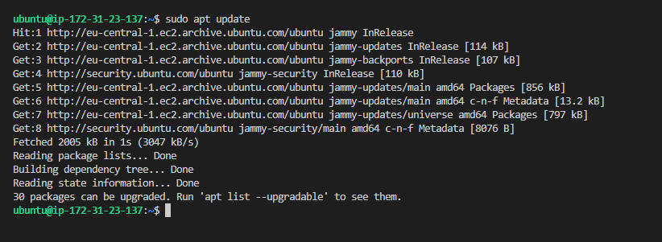

`sudo apt install apache2`

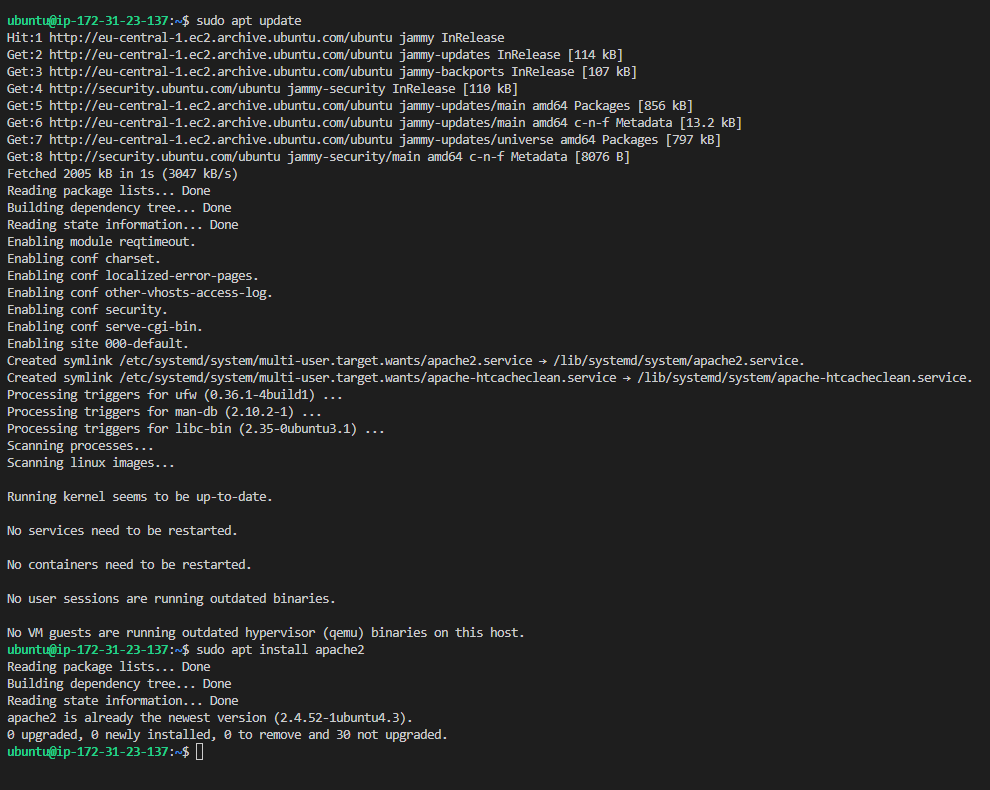

`sudo systemctl status apache2`

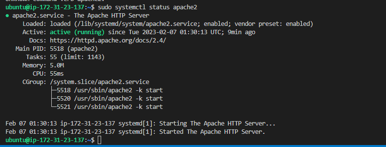

`sudo apt upgrade`

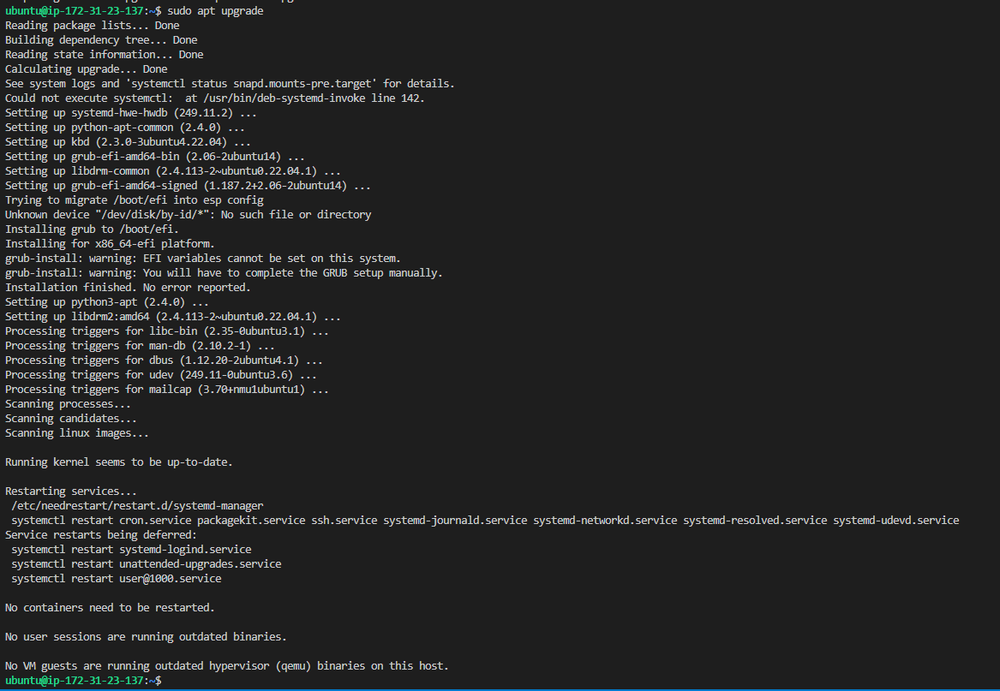

open inbound port 80

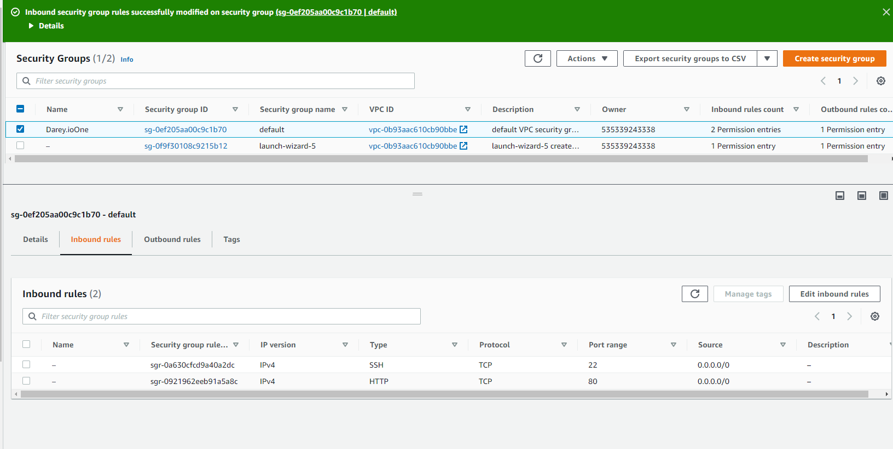

curl http://localhost:80

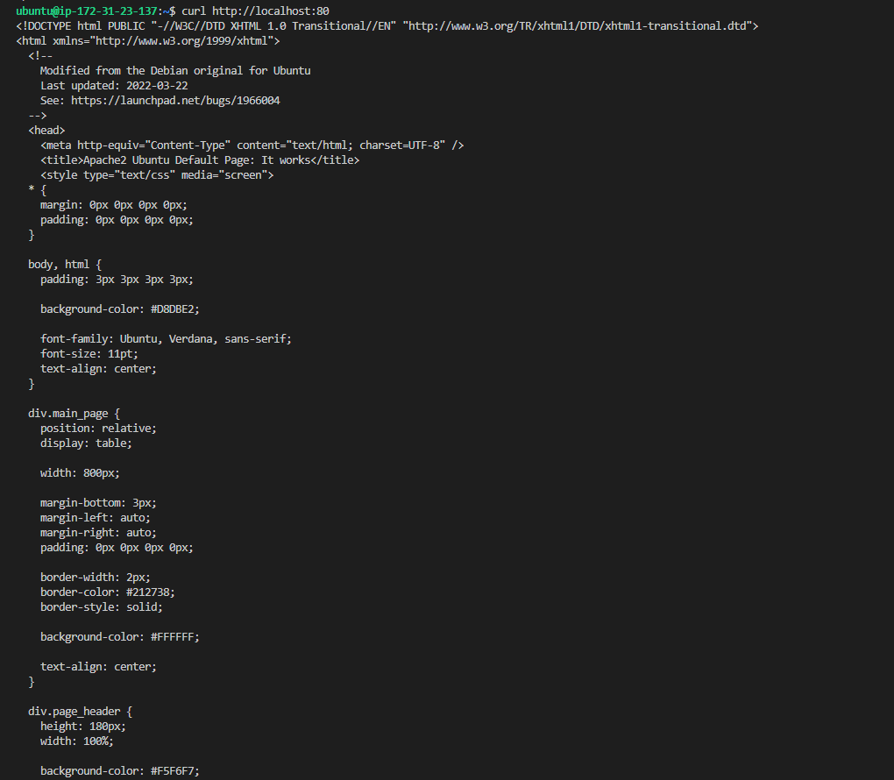

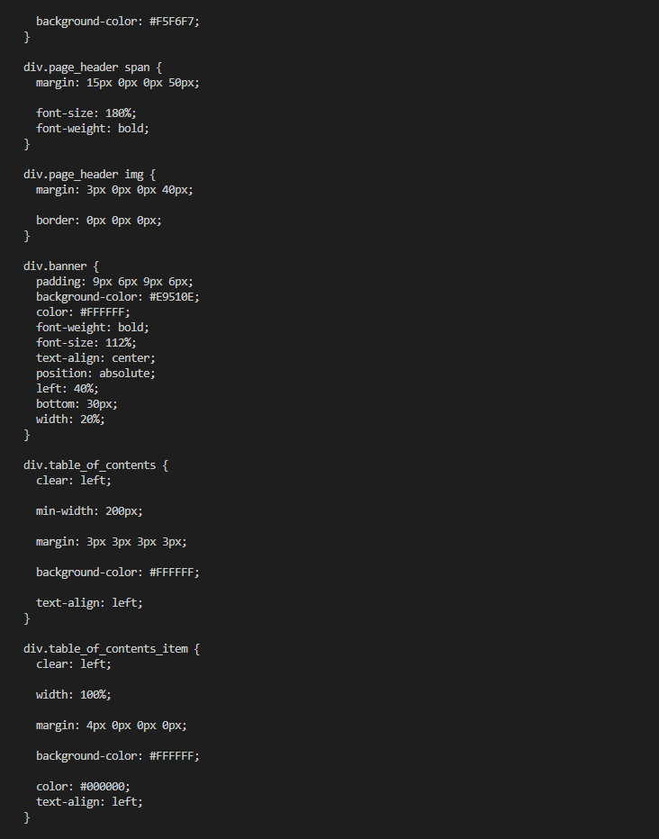

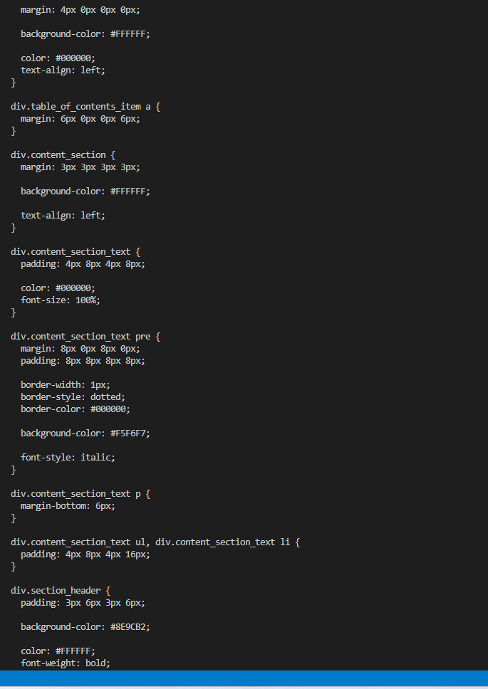

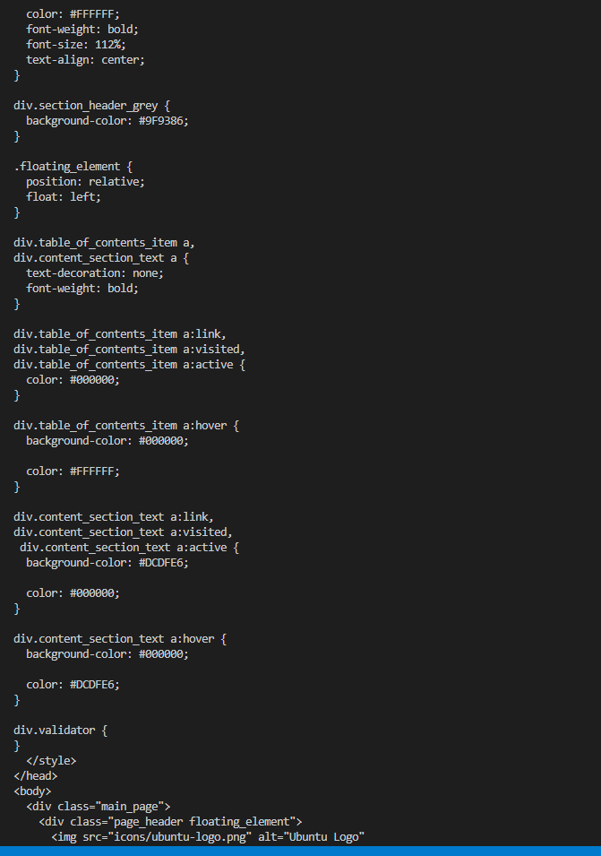

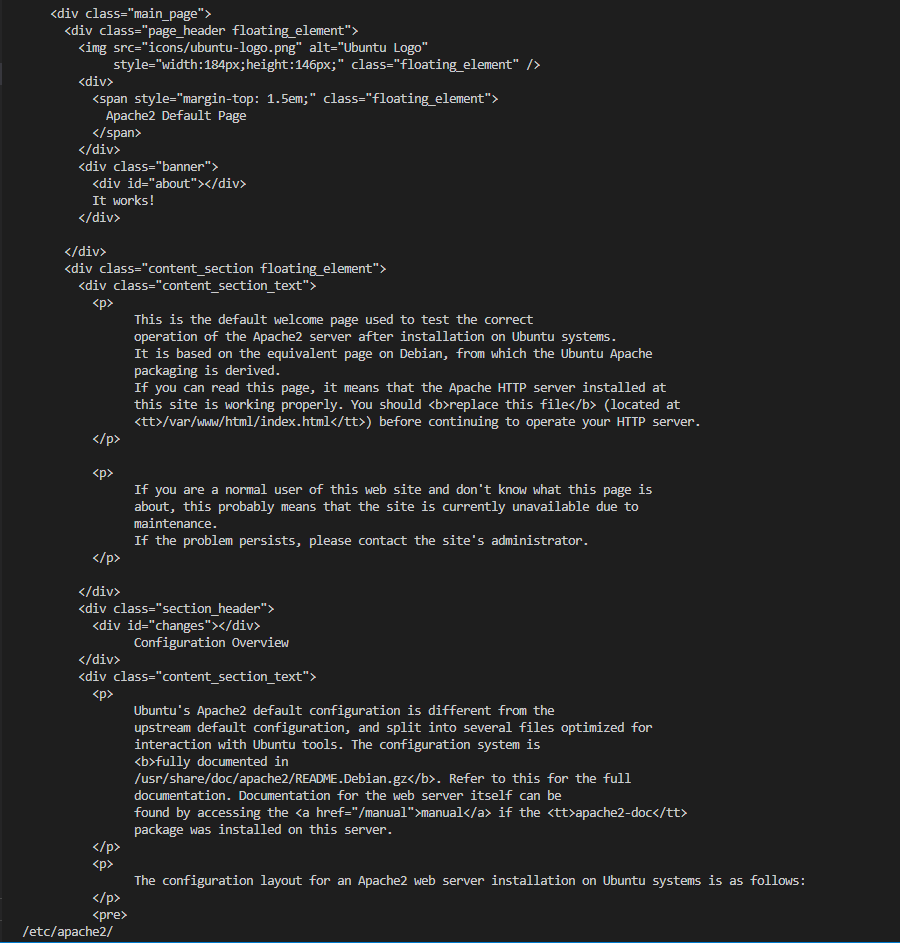

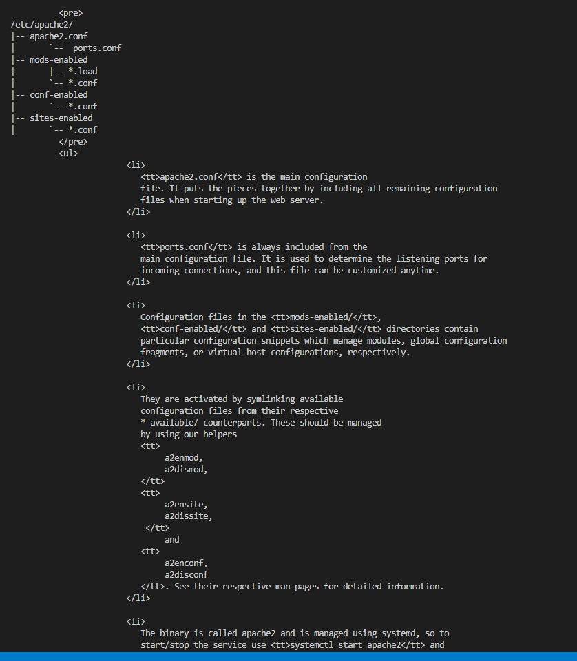

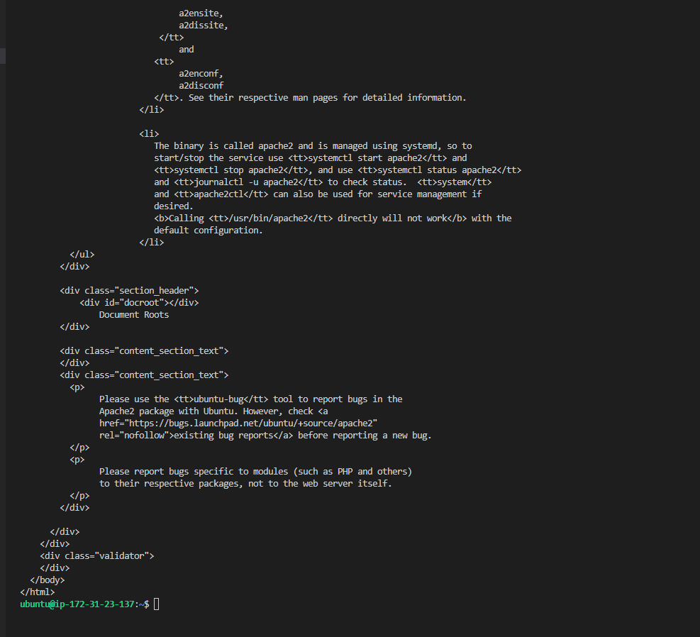

[opening web browser with public ip](./images/public-ip-on-browser-apache2-default-page.png)

`curl -s http://169.254.169.254/latest/meta-data/public-ipv4`

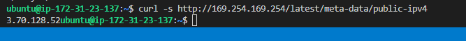

`sudo apt install mysql-server`

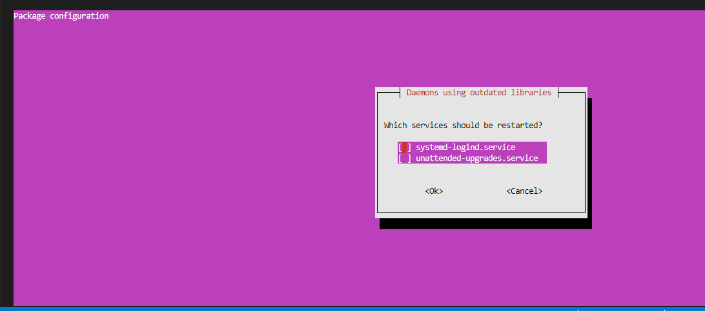

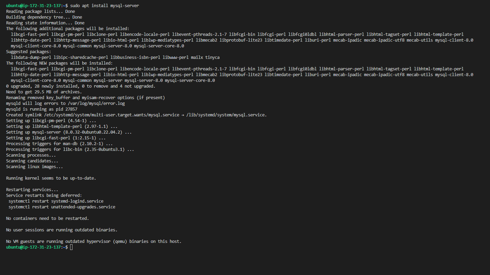

`sudo mysql`

[sudo mysql](./images/sudo-mysql.png)

`sudo mysql_secure_installation`

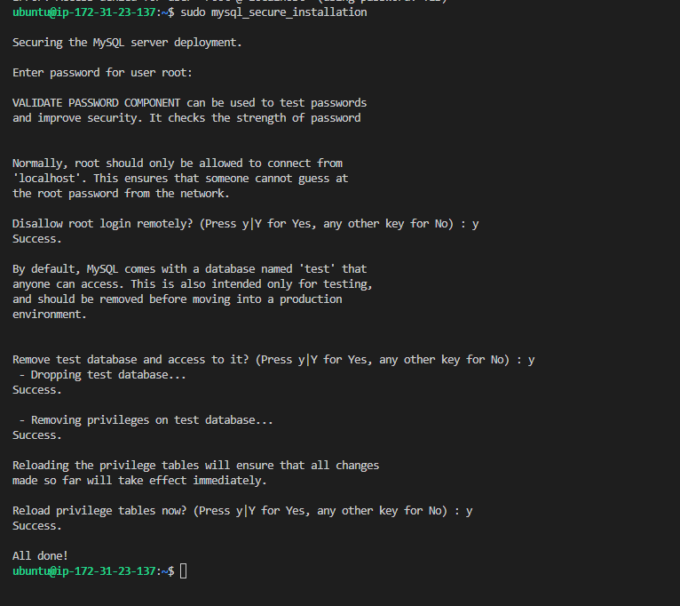

`sudo mysql -p`

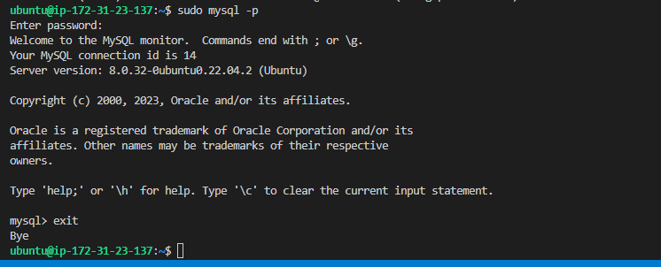

