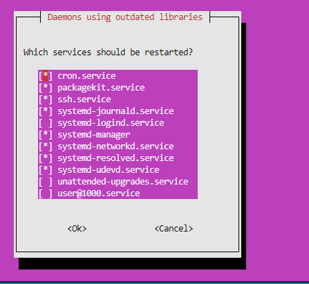

# Documentation of project-1 2023

## Lamp stack implementation

### Installing apache2 webserver

`sudo apt update`

`sudo apt install apache2`

`sudo systemctl status apache2`

`sudo apt upgrade`

open inbound port 80

curl http://localhost:80

[opening web browser with public ip](./images/public-ip-on-browser-apache2-default-page.png)

`curl -s http://169.254.169.254/latest/meta-data/public-ipv4`

Installing mysql-server

`sudo apt install mysql-server`

`sudo mysql`

[sudo mysql](./images/sudo-mysql.png)

`sudo mysql_secure_installation`

`sudo mysql -p`

Installing php

`sudo apt install php libapache2-mod-php php-mysql`

`php -v`

Creating a virtual host for website using apache

`sudo mkdir /var/www/projectlamp`

`sudo chown -R $USER:$USER /var/www/projectlamp`

`sudo vi /etc/apache2/sites-available/projectlamp.conf`

`sudo ls /etc/apache2/sites-available`

`sudo a2ensite projectlamp`

`sudo a2dissite 000-default`

`sudo apache2ctl config test`

`sudo systemctl reload apache 2`

`sudo echo 'Hello LAMP from hostname' $(curl -s http://169.254.169.254/latest/meta-data/public-hostname) 'with public IP' $(curl -s http://169.254.169.254/latest/meta-data/public-ipv4) > /var/www/projectlamp/index.html`

[website url using IP](http://3.70.128.52:80)

[opening website using IP](./images/opening-website-using-IP.png)

`http://ec2-3-70-128-52.eu-central-1.compute.amazonaws.com`

Enabling PHP on website

`sudo vim /etc/apache2/mods-enabled/dir.conf`

`sudo systemctl reload apache2`

`vim /var/www/projectlamp/index.php`

refresh page

`sudo rm /var/www/projectlamp/index.php`

